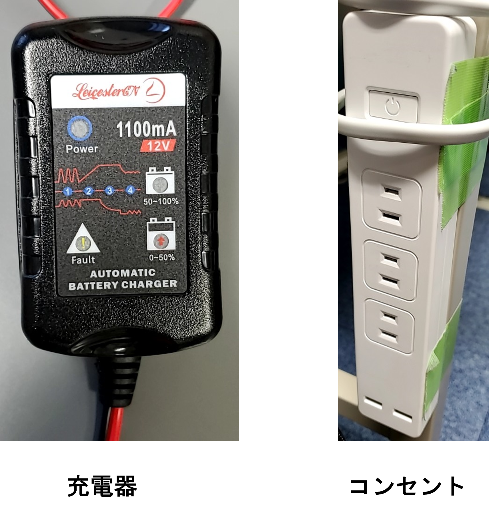
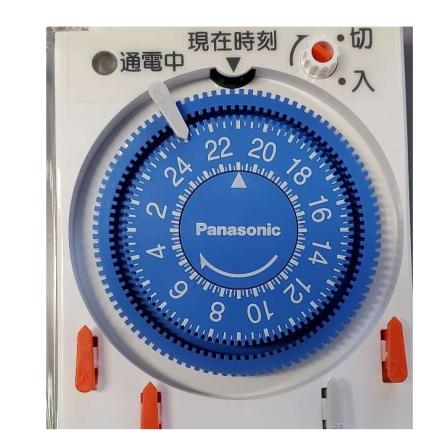

# 鉛蓄電池充電方法
ここでは研究室で使用している鉛蓄電池の充電方法について説明する。

## 注意事項
◯ **12 V バッテリーの場合,電圧が 12 V を下回ってはいけない**  
&emsp;**定期的に充電しましょう** 
◯ **使用したら、なるべくすぐ充電する** 
◯ **バッテリーを充電したまま帰宅しない**

## 充電手順

1. タイマーをセットする。タイマーのセットについては[次章参照](#タイマー設定方法)。
2. コンセント(吉澤の机脇にある)と充電器を繋ぐ。
3. タイマーを通電状態にセット。
4. 充電が終わるまで待つ。(12 V バッテリーで 13.0 ~ 13.4 V ぐらいまで)

 

## タイマー設定方法
- タイマーは二種類 (アナログとデジタルタイプ) -> アナログのみになりました．
- 設定する時間はバッテリーの容量と充電器の出力によって決める。 
  
  (例) 
  バッテリー容量 5 Ah, 充電器 1100 mA でテスターによる計測電圧が12.6 V の場合　充電時間：約1時間 &emsp; <- あくまで目安

### アナログ
1. 下図左の現在時刻から充電時間分進んだ目盛に白いストッパーをセットする。(1 目盛は 15 分)

2. 図の右上の入切ネジを時計回りに回して「入」にする。 
   これで通電される(LED がオレンジに)

### デジタル
&emsp;通電を ON と OFF にする曜日と時間を指定できる。(13 パターン) 
&emsp;1つを11:00 ~ 17:30 に ON するように設定してある。
1. 表示されている現在時刻を確認。

2. 通電が OFF になっている場合,ON にする。 
・「プログラム」のボタンを押す。 
・「曜日」「時」「分」のボタンを押して ON の時間を設定 
・「時計」を押して戻る。

3. 通電 OFF にする時間を設定 
・ON を設定するときと同じ。 
・表示がOFFになっていることを確認。

