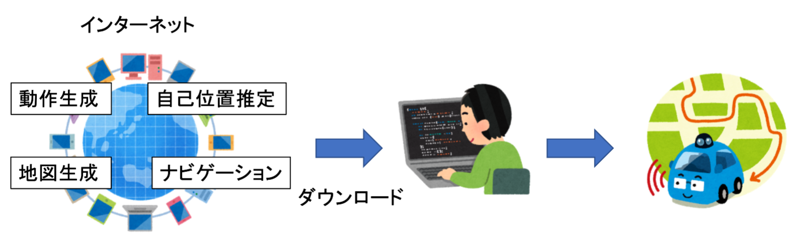

# なぜROSをやる必要があるのか？

ロボット開発には​画像処理，センシング，運動学​，確率統計，ネットワーク，計算機科学，．．など​，あらゆる知識が求められる​．  
センサなどが増えたらその分処理，工程が増えるのでプログラムを書くのがしんどくなってくる​．

しかし現在，インターネット時代，オープンソースソフトウェア文化，などによりネット上に多くのパッケージが存在している．  
それらを用いて組み合わせることで高度なアルゴリズムを手軽に実装できる．​  
（あくまでも昔と比較してです．基礎となる数学やプログラミングの知識は必要です．）​

独立したプロセス（この表現が正しいかはしっかり確認してません．あくまでニュアンスです．）として各アルゴリズムが実装されるので，各処理の統合・分離が簡単にできる．（センサフュージョンなど）  
処理ごとに分担して作成し，最後に統合するなどが簡単にできる．​  

グダグダ説明したけど言いたいことはただ一つ​
 
 

つべこべ言わずにROSを勉強しよう​