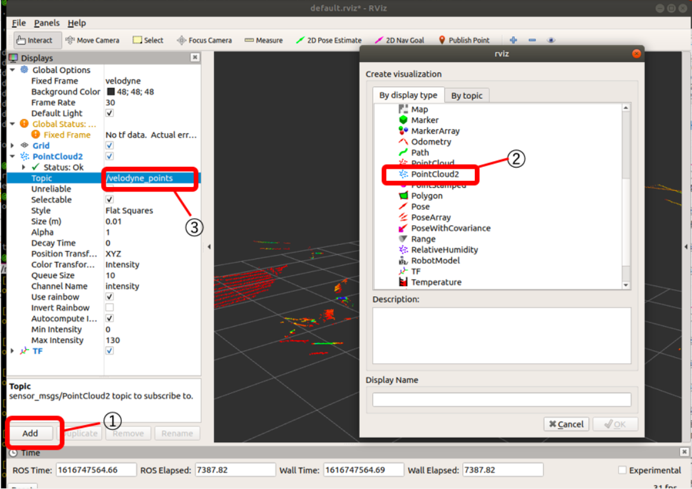

# velodyne 設定手順 

＊ROSのインストールやチュートリアルが一通り終わってる前提です。 

## 0.ネットワーク設定 

＊ここは、自分は特に設定しなくて問題なくvelodyneを使用できたので(1.諸々のインストール)以降の操作を行ってうまく行かなかった場合に確認するくらいでいいと思います。 
 
① すべての設定→ネットワーク設定→有線→オプション→IPv4設定 

方式を手動、IPアドレスは初期設定では192.168.0.1など 


② IPアドレスの設定を行う 

以下のコマンドでVLP16のネットワークインターフェースを調べコピーする 

```
$ ifconfig 
```

上で調べたものに192.168.3.Xの範囲でIPアドレスを割り当てる 

```
$ sudo ifconfig eth0 192.168.3.100 
```

4.2で追加したアドレスにスタティクルートを追加する 

アドレスは付属のCDについている（らしい） 

例えばスタティックルートが192.168.1.201の場合， 

```
$ sudo route add 192.168.1.201 eth0 
```

## 1.諸々のインストール 

① ROS依存関係のインストール（[melodic]の部分は自分のROSのversionに合わせて変更。ubuntu16→[kinetic]、ubuntu18→[melodic]、ubuntu20→[noetic]） 

```
$ sudo apt-get install ros-melodic-velodyne 
```

② VLPドライバーのインストール 

階層を移動し、githubからドライバをインストール 

```
$ cd ~/catkin_ws/src/ && git clone https://github.com/ros-drivers/velodyne.git 
```

③ 同じ階層で依存関係を更新 

```
$ rosdep install --from-paths src --ignore-src --rosdistro YOURDISTRO -y 
```

④ 階層移動＆ワークスペースの構築 

```
$ cd ~/catkin_ws/ && catkin_make 
```

## 2.データ表示 

① 点群表示をするためのコマンド 

```
$ roslaunch velodyne_pointcloud VLP16_points.launch 
```

② 動いているノードを確認 

```
$ rosnode list 
```

③ 送受信されているトピックを確認 

```
$ rostopic echo /velodyne_points 
```

④ 新しいターミナルを開く。rvizで３次元点群を表示させる 

```
$ rosrun rviz rviz -f velodyne 
```

⑤ rviz画面の設定 

画面左の「Displays」から、下の方の「Add」をクリック→「PointCloud2」を選択 

「PointCloud2」のTopicに「/velodyne_points」を選択 



これでVelodyneのデータがrviz上に表示されるはず 


## 参考 

http://wiki.ros.org/velodyne/Tutorials/Getting%20Started%20with%20the%20Velodyne%20VLP16 

https://github.com/open-rdc/orne_navigation/wiki/VLP16%E3%81%AE%E9%81%8B%E7%94%A8 

 
 
