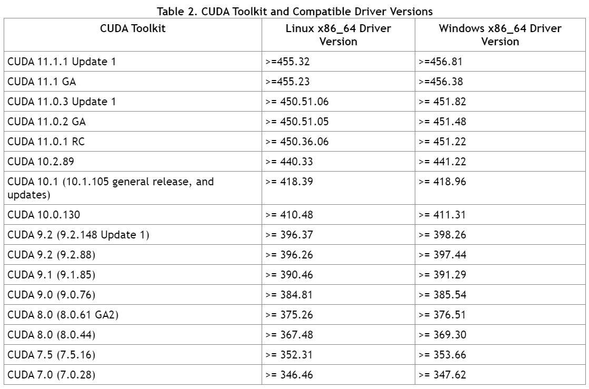

# ROSでdarknet_ros(YOLO)の導入


## 必要なこと

- darknet_rosのパッケージを入れる。
- YOLOでGPUを使う場合(CPUのみだと基本遅い，リアルタイムで処理したいなら使う)，NAVIDIA ドライバ，CUDA，cuDNNを入れる。
- カメラにRealSenseを使用する場合，RealSenseのROSでの導入についてを参照

## darknet_ros の導入
- 以下のとおりにインストール。
　https://demura.net/robot/16542.html
- 動作が確認できたらGPU処理の設定に `darknet/Makefile` を以下に変更

```darknet/Makefile
GPU=1
CUDNN=1
OPENCV=0
OPENMP=0
DEBUG=0
```

動作させてfpsが変化していないようならGPUを使えるように設定する。

## GPU の設定()

NVIDIA Driver, CUDA Toolkit, cuDNNのインストールが必要。  
NVIDIA Driver, CUDAが入っているのか一度確認する。  

```　　
nvidia-smi
```

もし入れなおしたいとき場合，次で削除

```
sudo apt --purge remove "cublas*" "cuda*"
sudo apt --purge remove "nvidia*"
rm -rf /usr/local/cuda*
sudo apt-get autoremove && sudo apt-get autoclean
```

## NVIDIA Driver(CUDAのインストール中に勝手に入る)
1. まずGPUを確認する。
```
lspci | grep -i nvidia
```
2. 推奨ドライバを確認 recommendedとなっているもの
```
ubuntu-drivers devices
```

・CUDA, cuDNN
1. 何もないことを確認
```
dpkg -l | grep cuda
```
2. 以下に従って行う。バージョンなどはしっかり確認すること(1)。  
https://qiita.com/yukoba/items/3692f1cb677b2383c983  
<span style="color: red; ">ドライバとCUDAの対応を確認(2)。</span>



次のコマンドでドライバーが正しいこととCUDAのバージョンが表示されるのを確認
```
navidia-smi
nvcc -V
```
１行目のコマンドでCUDAのバージョンが異なる場合があるが，2行目で正しいバージョンが表
示されれば問題ない．


## 動作確認

| PC | RAM | OS | ROS version | CPU | GPU |
|:-:|:-:|:-:|:-:|:-:|:-:|
| mouse-pc（山内さんのパソコン） | 32 GB | Ubuntu 16.04 | Kinetic |CPU：Intel(R) Core(TM) i7-6700HQ CPU @ 2.60GHz | GPU： NVIDIA Corporation GM206M [GeForce GTX 965M] |

成功したもの

Nvidia Driver : 455.32.00, CUDA : 9.0, cuDNN : 7.6.5

darknet_ros.launch

単眼カメラ　　50~70 fps D455 50~70 fps  
yolo_v3.launch  
単眼カメラ　　10 fps D455 10fps  
→カメラのよる違いなし  

## 詰まったこと

CUDAv10.1を用いた場合,catkin_makeでエラーがでる．特定のLibraryへのアクセスが出きないらしい．

→ /usr/local にcuda,cuda-10.1の他にcuda-10.2のフォルダが存在  
→ 必要なヘッダファイルがわけられていまい，パスが通らないことが原因？  
→ 同様のエラーがでている報告があるが，問題ない場合もある．  
Ubuntuのバージョン？ドライバ？  
→ CUDAのバージョンを変更して解決  

## その他参考
1) TensorFlow を使う場合，CUDA とcuDNNのバージョンの対応は決まっている。  
https://qiita.com/chin_self_driving_car/items/f00af2dbd022b65c9068  
2) https://docs.nvidia.com/cuda/cuda-toolkit-release-notes/index.html  